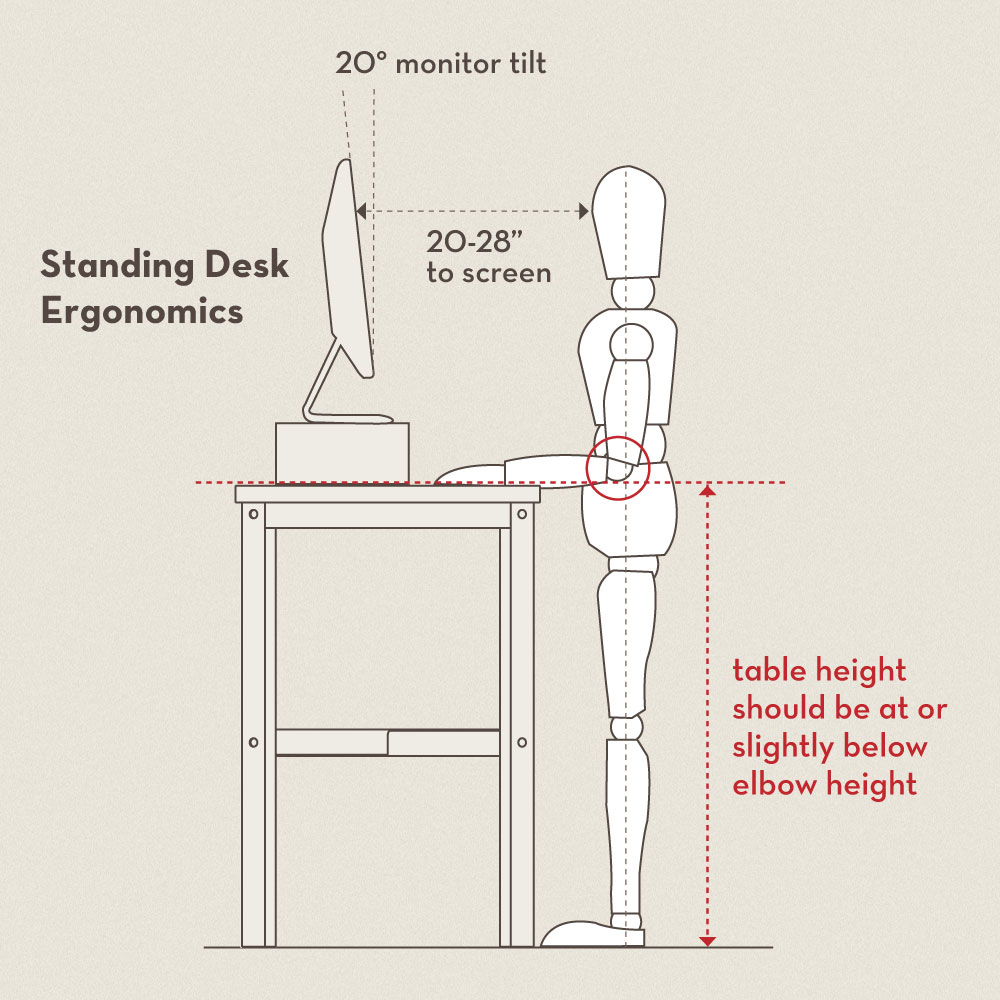

# Computing Hardware

## Computers

We have standardised on using Apple hardware for the ease of use, software availability and reasonable service options.

As a lot of our work requires us to travel, we strongly suggest one of two laptop sizes - the 13" Macbook Pro for portability or the 16" Macbook Pro for more intensive work. If you use a laptop, we'll set you up with a height adjustable monitor, a comfortable mouse and keyboard \(you'll find that a lot of us are mechanical keyboard fans\). Your Team Lead will make sure that you have your hardware ready on [your First Day](../starting-at-obvious/your-first-day.md), and you can get set up with all our services and tools over the course of your first week.

| Device | Manufacturer | Key Specs | More Information |
| :--- | :--- | :--- | :--- |
| Macbook - Power Option | Apple MacBook Pro 16" | 2.4GHz quad‑core Intel Core i5, 8GB of RAM | [Link](https://www.apple.com/in/macbook-pro-13/) |
| Macbook - Portable Option | Apple MacBook Pro 16" | 2.3GHz 8‑core Intel Core i9, 16GB of RAM | [Link](https://www.apple.com/in/macbook-pro-16/) |
| Monitor | Dell Ultrasharp 27" | U2718Q \(4K\) | [Link](https://www.dell.com/en-in/shop/dell-ultrasharp-27-4k-monitor-u2718q/apd/210-amuf/monitors-monitor-accessories) |
| Standing Desk | Haworth | Haworth Planes Sit Stand Desk | [Link](https://www.haworth.com/products/tables/height-adjustable/planes) |

### Workspace

Make sure that you set your workspace up to be appropriate for yourself - there's a [detailed guide over here](http://ergo.human.cornell.edu/ergoguide.html). Everyone gets a sit-stand desk by default - even if you don't use it in a standing configuration, you can adjust the height so it's perfect for you - after all, we are all a variety of shapes and sizes.

## Team devices

### Design

Many folks in the design team end up using an iPad Pro and an Apple Pencil - they are exceptionally useful for sketching, taking notes during user research etc. You can ask your team lead to arrange one for you.

### Android

If you don't own an Android phone, we'll make sure that you have one that you can use both personally as well as to ensure that your code compiles perfectly!

## Care & responsibility 

While all our hardware is insured, we expect you to treat all of it with care. We have a [Device Test Lab](https://clearleft.com/testlab) planned, which uses older devices to ensure that all the websites and apps that we make work on a range of hardware and software. 

We recommend a protective case. Costs for all repairs and damage that isn't covered by insurance \(if you drop your device, or lose it for instance\) can be high, and depending on the circumstances, have to be borne by you.

